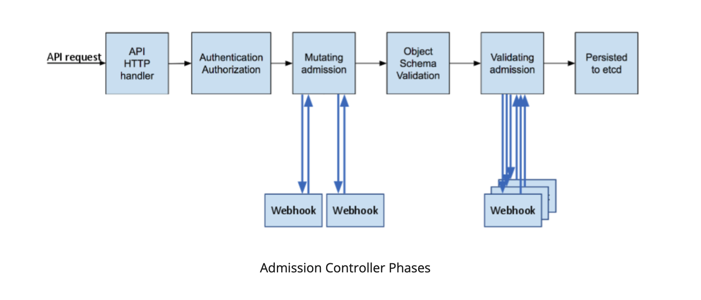

## admission flow
- Kubernetes admission controllers are plugins that govern and enforce how the cluster is used. They can be thought of as a gatekeeper that intercept (authenticated) API requests and may change the request object or deny the request altogether. The admission control process has two phases: the mutating phase is executed first, followed by the validating phase. Consequently, admission controllers can act as mutating or validating controllers or as a combination of both. (source: https://kubernetes.io/blog/2019/03/21/a-guide-to-kubernetes-admission-controllers/)



## install gatekeeper with helm
- add helm repo
```
$ helm repo add gatekeeper https://open-policy-agent.github.io/gatekeeper/charts
``` 

- install gatekeeper (the following command will install gatekeeper in the namespace `gatekeeper-system`.
```
$ helm install gatekeeper/gatekeeper --name-template=gatekeeper --namespace gatekeeper-system --create-namespace
``` 

- check whether gatekeeper is working fine
```
$ kubectl get  all -n gatekeeper-system
NAME                                                 READY   STATUS    RESTARTS      AGE
pod/gatekeeper-audit-85b4f49c6f-srtxh                1/1     Running   1 (15m ago)   16m
pod/gatekeeper-controller-manager-6cb75c588f-dmgpf   1/1     Running   0             16m
pod/gatekeeper-controller-manager-6cb75c588f-jk2dq   1/1     Running   0             16m
pod/gatekeeper-controller-manager-6cb75c588f-ptjvq   1/1     Running   0             16m

NAME                                 TYPE        CLUSTER-IP    EXTERNAL-IP   PORT(S)   AGE
service/gatekeeper-webhook-service   ClusterIP   10.216.2.86   <none>        443/TCP   16m

NAME                                            READY   UP-TO-DATE   AVAILABLE   AGE
deployment.apps/gatekeeper-audit                1/1     1            1           16m
deployment.apps/gatekeeper-controller-manager   3/3     3            3           16m

NAME                                                       DESIRED   CURRENT   READY   AGE
replicaset.apps/gatekeeper-audit-85b4f49c6f                1         1         1       16m
replicaset.apps/gatekeeper-controller-manager-6cb75c588f   3         3         3       16m

```

- Let's see how to set up webhook
```
$ kubectl get validatingwebhookconfiguration gatekeeper-validating-webhook-configuration    -o yaml
apiVersion: admissionregistration.k8s.io/v1
kind: ValidatingWebhookConfiguration
metadata:
  annotations:
    meta.helm.sh/release-name: gatekeeper
    meta.helm.sh/release-namespace: gatekeeper-system
  creationTimestamp: "2023-09-12T01:18:53Z"
  generation: 2
  labels:
    app: gatekeeper
    app.kubernetes.io/managed-by: Helm
    chart: gatekeeper
    gatekeeper.sh/system: "yes"
    heritage: Helm
    release: gatekeeper
  name: gatekeeper-validating-webhook-configuration
  resourceVersion: "606102655"
  uid: 3ed9148e-594e-438e-bdfd-bacb4d52a6f8
webhooks:
- admissionReviewVersions:
  - v1
  - v1beta1
  clientConfig:
    caBundle: L****Cg==
    service:
      name: gatekeeper-webhook-service
      namespace: gatekeeper-system
      path: /v1/admit
      port: 443
  failurePolicy: Ignore
  matchPolicy: Exact
  name: validation.gatekeeper.sh
  namespaceSelector:
    matchExpressions:
    - key: admission.gatekeeper.sh/ignore
      operator: DoesNotExist
    - key: kubernetes.io/metadata.name
      operator: NotIn
      values:
      - gatekeeper-system
  objectSelector: {}
  rules:
  - apiGroups:
    - '*'
    apiVersions:
    - '*'
    operations:
    - CREATE
    - UPDATE
    resources:
    - '*'
    - pods/ephemeralcontainers
    - pods/exec
    - pods/log
    - pods/eviction
    - pods/portforward
    - pods/proxy
    - pods/attach
    - pods/binding
    - deployments/scale
    - replicasets/scale
    - statefulsets/scale
    - replicationcontrollers/scale
    - services/proxy
    - nodes/proxy
    - services/status
    scope: '*'
  sideEffects: None
  timeoutSeconds: 3
- admissionReviewVersions:
  - v1
  - v1beta1
  clientConfig:
    caBundle: LS*****Cg==
    service:
      name: gatekeeper-webhook-service
      namespace: gatekeeper-system
      path: /v1/admitlabel
      port: 443
  failurePolicy: Fail
  matchPolicy: Exact
  name: check-ignore-label.gatekeeper.sh
  namespaceSelector:
    matchExpressions:
    - key: kubernetes.io/metadata.name
      operator: NotIn
      values:
      - gatekeeper-system
  objectSelector: {}
  rules:
  - apiGroups:
    - ""
    apiVersions:
    - '*'
    operations:
    - CREATE
    - UPDATE
    resources:
    - namespaces
    scope: '*'
  sideEffects: None
  timeoutSeconds: 3


```

## Configure constraint template
- define `constraint template`. (https://github.com/open-policy-agent/gatekeeper-library/tree/master/library/general/allowedrepos/samples/repo-must-be-openpolicyagent = https://oreil.ly/ikfZk). However, we should refer to https://github.com/open-policy-agent/gatekeeper-library/blob/master/library/general/allowedrepos/template.yaml (I already downloaded and saved it as 20-1_allowedrepos-constraint-template.yaml)
```
$ kubectl apply -f 20-1_allowedrepos-constraint-template.yaml 
constrainttemplate.templates.gatekeeper.sh/k8sallowedrepos created 
```

## Configure constraint resource
- define contraint resource. In fact, that's the policy that really defines what objects/resources are allowed to use.
```
$ kubectl apply -f 20-2_allowedrepos-constraint.yaml 
k8sallowedrepos.constraints.gatekeeper.sh/repo-is-kuar-demo created
``` 

## Let's give it a try
- Define a POD with a valid repo `gcr.io/kuar-demo/kuard-amd64:blue` and apply it
```
$ kubectl apply -f 20-3_compliant-pod.yaml 
pod/kuard created
```

- Define a POD without defining any repo. k8s should pull image from default repo `dockerhub`
```
$ kubectl apply -f 20-4_noncompliant-pod.yaml 
Error from server (Forbidden): error when creating "20-4_noncompliant-pod.yaml": admission webhook "validation.gatekeeper.sh" denied the request: [repo-is-kuar-demo] container <nginx> has an invalid image repo <nginx>, allowed repos are ["gcr.io/kuar-demo/"]
```

- Let's check what PODs are running. Only 1 POD `kuard` is running.
```
$ kubectl get pods
NAME    READY   STATUS    RESTARTS   AGE
kuard   1/1     Running   0          38s
```

## Auditing
- delete the constraint resource defined before. 
```
$ kubectl delete -f 20-2_allowedrepos-constraint.yaml 
k8sallowedrepos.constraints.gatekeeper.sh "repo-is-kuar-demo" deleted
```
- define the contraint resource defined in `20-5_allowedrepos-dryrun.yaml`
```
$ kubectl apply -f 20-5_allowedrepos-dryrun.yaml 
k8sallowedrepos.constraints.gatekeeper.sh/repo-is-kuar-demo created
```
- Let's try to create a POD with `20-4_noncompliant-pod.yaml`
```
$ kubectl apply -f 20-4_noncompliant-pod.yaml 
pod/nginx-noncompliant created

$ kubectl get pods
NAME                 READY   STATUS    RESTARTS   AGE
kuard                1/1     Running   0          23m
nginx-noncompliant   1/1     Running   0          11s  <-- This POD is allowed to create

```

- Check auditing log(?)
```
$ kubectl get constraint 
NAME                ENFORCEMENT-ACTION   TOTAL-VIOLATIONS
repo-is-kuar-demo   dryrun               1

$ kubectl get constraint  repo-is-kuar-demo   -o yaml
apiVersion: constraints.gatekeeper.sh/v1beta1
kind: K8sAllowedRepos
metadata:
  annotations:
    kubectl.kubernetes.io/last-applied-configuration: |
      {"apiVersion":"constraints.gatekeeper.sh/v1beta1","kind":"K8sAllowedRepos","metadata":{"annotations":{"resource":"https://github.com/open-policy-agent/gatekeeper-library/blob/master/library/general/allowedrepos/samples/repo-must-be-openpolicyagent/constraint.yaml"},"name":"repo-is-kuar-demo"},"spec":{"enforcementAction":"dryrun","match":{"kinds":[{"apiGroups":[""],"kinds":["Pod"]}],"namespaces":["default","fuming-poc"]},"parameters":{"repos":["gcr.io/kuar-demo/"]}}}
    resource: https://github.com/open-policy-agent/gatekeeper-library/blob/master/library/general/allowedrepos/samples/repo-must-be-openpolicyagent/constraint.yaml
  creationTimestamp: "2023-09-28T01:21:04Z"
  generation: 1
  name: repo-is-kuar-demo
  resourceVersion: "1204550"
  uid: a6937e00-4b13-44c7-9ee7-a138443a78ec
spec:
  enforcementAction: dryrun
  match:
    kinds:
    - apiGroups:
      - ""
      kinds:
      - Pod
    namespaces:
    - default
    - fuming-poc
  parameters:
    repos:
    - gcr.io/kuar-demo/
status:
  auditTimestamp: "2023-09-28T01:23:14Z"   <---- last timestamp that execute auditing
  byPod:
  - constraintUID: a6937e00-4b13-44c7-9ee7-a138443a78ec
    enforced: true
    id: gatekeeper-audit-66fb884cd7-sbc5x
    observedGeneration: 1
    operations:
    - audit
    - mutation-status
    - status
  - constraintUID: a6937e00-4b13-44c7-9ee7-a138443a78ec
    enforced: true
    id: gatekeeper-controller-manager-644cff9d9f-2872c
    observedGeneration: 1
    operations:
    - mutation-webhook
    - webhook
  - constraintUID: a6937e00-4b13-44c7-9ee7-a138443a78ec
    enforced: true
    id: gatekeeper-controller-manager-644cff9d9f-6zlfv
    observedGeneration: 1
    operations:
    - mutation-webhook
    - webhook
  - constraintUID: a6937e00-4b13-44c7-9ee7-a138443a78ec
    enforced: true
    id: gatekeeper-controller-manager-644cff9d9f-pp7mf
    observedGeneration: 1
    operations:
    - mutation-webhook
    - webhook
  totalViolations: 1                       <---- How many violation in total.
  violations:                              <---- detailed info that violate constraint
  - enforcementAction: dryrun
    group: ""
    kind: Pod
    message: container <nginx> has an invalid image repo <nginx>, allowed repos are
      ["gcr.io/kuar-demo/"]
    name: nginx-noncompliant
    namespace: default
    version: v1

```

## Mutating
- make sure `mutation` is enabled in gatekeeper (https://oreil.ly/DQKhl = https://open-policy-agent.github.io/gatekeeper/website/docs/mutation/). `mutation` is enabled by default if gatekeeper version >= 3.10.0
```
$ kubens gatekeeper-system
Context "gke_gogox-analytics-non-prod_asia-southeast1-a_gogox-analytics-non-prod-fuming-gke" modified.
Active namespace is "gatekeeper-system".

$ helm ls
NAME      	NAMESPACE        	REVISION	UPDATED                             	STATUS  	CHART            	APP VERSION
gatekeeper	gatekeeper-system	1       	2023-09-28 08:23:34.103616 +0800 CST	deployed	gatekeeper-3.13.0	v3.13.0         <---- mutation is enabled because verion >= 3.10.0 
```

- Let's apply a mutation assignment `20-6_imagepullpolicyalways-mutation.yaml`.

```
$ kubectl apply -f 20-6_imagepullpolicyalways-mutation.yaml 
assign.mutations.gatekeeper.sh/demo-image-pull-policy created

$ kubectl get assign
NAME                     AGE
demo-image-pull-policy   8s
(base) MacBook-Pro:~/Desktop/gogox/study/k8s-study/basic-knowledge/ch20 $ kubectl get assign demo-image-pull-policy   -o yaml
apiVersion: mutations.gatekeeper.sh/v1
kind: Assign
metadata:
  annotations:
    kubectl.kubernetes.io/last-applied-configuration: |
      {"apiVersion":"mutations.gatekeeper.sh/v1alpha1","kind":"Assign","metadata":{"annotations":{},"name":"demo-image-pull-policy"},"spec":{"applyTo":[{"groups":[""],"kinds":["Pod"],"versions":["v1"]}],"location":"spec.containers[name:*].imagePullPolicy","match":{"excludedNamespaces":["system"],"kinds":[{"apiGroups":["*"],"kinds":["Pod"]}],"scope":"Namespaced"},"parameters":{"assign":{"value":"Always"}}}}
  creationTimestamp: "2023-09-28T01:40:56Z"
  generation: 1
  name: demo-image-pull-policy
  resourceVersion: "1212677"
  uid: 5ce734c9-dfbb-4deb-bac9-a98828106e30
spec:
  applyTo:
  - groups:
    - ""
    kinds:
    - Pod
    versions:
    - v1
  location: spec.containers[name:*].imagePullPolicy
  match:
    excludedNamespaces:
    - system
    kinds:
    - apiGroups:
      - '*'
      kinds:
      - Pod
    scope: Namespaced
  parameters:
    assign:
      value: Always
status:
  byPod:
  - enforced: true
    id: gatekeeper-audit-66fb884cd7-sbc5x
    mutatorUID: 5ce734c9-dfbb-4deb-bac9-a98828106e30
    observedGeneration: 1
    operations:
    - audit
    - mutation-status
    - status
  - enforced: true
    id: gatekeeper-controller-manager-644cff9d9f-2872c
    mutatorUID: 5ce734c9-dfbb-4deb-bac9-a98828106e30
    observedGeneration: 1
    operations:
    - mutation-webhook
    - webhook
  - enforced: true
    id: gatekeeper-controller-manager-644cff9d9f-6zlfv
    mutatorUID: 5ce734c9-dfbb-4deb-bac9-a98828106e30
    observedGeneration: 1
    operations:
    - mutation-webhook
    - webhook
  - enforced: true
    id: gatekeeper-controller-manager-644cff9d9f-pp7mf
    mutatorUID: 5ce734c9-dfbb-4deb-bac9-a98828106e30
    observedGeneration: 1
    operations:
    - mutation-webhook
    - webhook

```

- Ideally, we should have a POD `kuard` after applying `20-3_compliant-pod.yaml`. Its image pull policy is `IfNotPresent`
```
$ kubectl get pods kuard
NAME    READY   STATUS    RESTARTS   AGE
kuard   1/1     Running   0          60m

$ kubectl get pods  kuard -o=jsonpath="{.spec.containers[0].imagePullPolicy}"
IfNotPresent
```

- We can delete it and re-apply `20-3_compliant-pod.yaml` again. I found `mutation` is not retroactive (溯及既往) by default. Any resources that are created before mutation assignment is are still valid.
```
$ kubectl delete -f 20-3_compliant-pod.yaml 
pod "kuard" deleted
$ kubectl apply -f 20-3_compliant-pod.yaml 
pod/kuard created
```

- Let's check its image pull policy.
```
$ kubectl get pods  kuard -o=jsonpath="{.spec.containers[0].imagePullPolicy}"    
Always    <-- already redefined as "Always"
```


